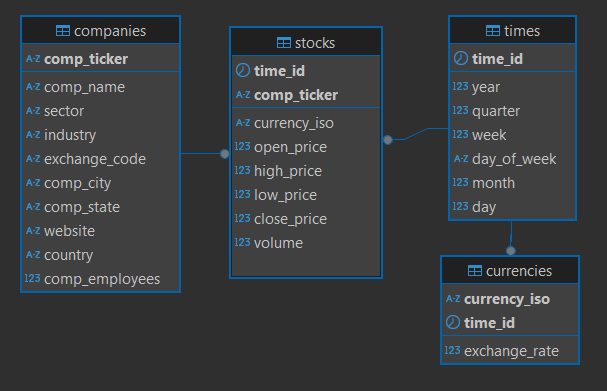

# S&P 500 Stock Data Warehouse

This document describes the schema for an OLAP (Online Analytical Processing) database designed to store and analyze stock market data for companies listed in the S&P 500 index. The data warehouse is organized using a star schema, with dimension tables providing context to a central fact table.

## ER Diagram of DWH 📊

## DataFlow Diagram 🧩

Github Actions automaticly updates DWH with data about all stocks 2 days backwards (refresh time of yfinance).

## Schema: `snp`

This is the primary schema that encapsulates all tables related to the S&P 500 data.

---

## Dimension Tables 🧊

Dimension tables provide descriptive context to the numerical data found in the fact table. They represent the "who, what, where, when, and why" of the data.

### 1. `snp.companies`

This table stores detailed information about each company.

| Column           | Data Type     | Constraints                               | Description                                                                 |
|------------------|---------------|-------------------------------------------|-----------------------------------------------------------------------------|
| `comp_ticker`    | `VARCHAR(5)`  | `PRIMARY KEY`                             | A short, unique stock ticker symbol for the company (e.g., AAPL for Apple). |
| `comp_name`      | `VARCHAR(100)`| `NOT NULL`, `UNIQUE`                      | The full legal name of the company (e.g., Apple Inc.).                      |
| `sector`         | `VARCHAR(50)` | `NOT NULL`                                | The economic sector the company belongs to (e.g., Technology).              |
| `industry`       | `VARCHAR(100)`| `NOT NULL`                                | The specific industry within the sector (e.g., Consumer Electronics).       |
| `exchange_code`  | `VARCHAR(4)`  |                                           | The code for the stock exchange where the company's stock is traded (e.g., NYQ). |
| `comp_city`      | `VARCHAR(50)` |                                           | The city where the company is headquartered.                                |
| `comp_state`     | `VARCHAR(3)`  |                                           | The state (or region/province) where the company is headquartered.          |
| `website`        | `VARCHAR(100)`|                                           | The company's official website address.                                     |
| `country`        | `VARCHAR(30)` |                                           | The country where the company is based.                                     |
| `comp_employees` | `INTEGER`     | `CHECK (comp_employees >= 0)`             | The number of full-time employees in the company.                           |

**Relationships:**
* Connects to `snp.stocks` via `comp_ticker`.

---

### 2. `snp.times`

This table breaks down dates into various components (year, quarter, month, etc.) for easier time-based analysis.

| Column        | Data Type    | Constraints   | Description                                                                          |
|---------------|--------------|---------------|--------------------------------------------------------------------------------------|
| `time_id`     | `DATE`       | `PRIMARY KEY` | The specific date. This is the unique identifier for a time record.                  |
| `year`        | `SMALLINT`   | `GENERATED`   | The year extracted from `time_id` (e.g., 2023).                                      |
| `quarter`     | `SMALLINT`   | `GENERATED`   | The quarter of the year (1, 2, 3, or 4) based on the month in `time_id`.             |
| `week`        | `SMALLINT`   | `GENERATED`   | The week number of the year (ISO 8601 standard) extracted from `time_id`.            |
| `day_of_week` | `VARCHAR(9)` | `GENERATED`   | The name of the day (e.g., Monday, Tuesday) extracted from `time_id`.                |
| `month`       | `SMALLINT`   | `GENERATED`   | The month number (1-12) extracted from `time_id`.                                    |
| `day`         | `SMALLINT`   | `GENERATED`   | The day of the month (1-31) extracted from `time_id`.                                |

**Relationships:**
* Connects to `snp.currencies` via `time_id`.
* Connects to `snp.stocks` via `time_id`.

---

### 3. `snp.currencies`

This table stores daily exchange rates for various currencies, presumably against a base currency like USD.

| Column          | Data Type       | Constraints                                  | Description                                                                    |
|-----------------|-----------------|----------------------------------------------|--------------------------------------------------------------------------------|
| `currency_iso`  | `CHAR(3)`       | Part of `PRIMARY KEY`                        | The standard 3-letter ISO code for a currency (e.g., EUR, JPY).                |
| `exchange_rate` | `DECIMAL(10,4)` | `NOT NULL`                                   | The exchange rate of this currency against a base currency for the given `time_id`. |
| `time_id`       | `DATE`          | Part of `PRIMARY KEY`, `FOREIGN KEY`         | The date for which this exchange rate is valid.                                |

**Foreign Keys:**
* `fk_currencies_times`: `time_id` references `snp.times(time_id)`.

**Relationships:**
* Connects to `snp.times` via `time_id`.
* Can be used to convert monetary values in `snp.stocks` if they are in different currencies.

---

## Fact Table 📈

The fact table contains the quantitative measurements or metrics of the business process being analyzed.

### `snp.stocks`

This table is the central fact table, storing daily stock performance data for each company.

| Column       | Data Type       | Constraints                                  | Description                                                                     |
|--------------|-----------------|----------------------------------------------|---------------------------------------------------------------------------------|
| `time_id`    | `DATE`          | Part of `PRIMARY KEY`, `FOREIGN KEY`         | The date of the stock record.                                                   |
| `comp_ticker`| `CHAR(5)`       | `NOT NULL`, Part of `PRIMARY KEY`, `FOREIGN KEY` | The ticker symbol of the company.                                               |
| `currency_iso`| `CHAR(3)`       | `DEFAULT 'USD'`                            | The currency in which the stock prices are reported (defaults to US Dollars).     |
| `open_price` | `DECIMAL(10,4)` | `NOT NULL`, `CHECK (open_price >= 0)`        | The price of the stock when the market opened on the `time_id`.                 |
| `high_price` | `DECIMAL(10,4)` | `NOT NULL`, `CHECK (high_price >= 0)`        | The highest price the stock reached during the `time_id`.                       |
| `low_price`  | `DECIMAL(10,4)` | `NOT NULL`, `CHECK (low_price >= 0)`         | The lowest price the stock reached during the `time_id`.                        |
| `close_price`| `DECIMAL(10,4)` | `NOT NULL`, `CHECK (close_price >= 0)`       | The price of the stock when the market closed on the `time_id`.                 |
| `volume`     | `BIGINT`        | `CHECK (volume >= 0)`                        | The number of shares traded for that stock on the `time_id`.                    |

**Primary Key:**
* `(time_id, comp_ticker)`: A composite key ensuring one record per company per day.

**Foreign Keys:**
* `fk_stocks_companies`: `comp_ticker` references `snp.companies(comp_ticker)`.
    * `ON UPDATE CASCADE`: If a `comp_ticker` in `snp.companies` is updated, it will also be updated here.
    * `ON DELETE RESTRICT`: Prevents deleting a company from `snp.companies` if it has related stock records.
* `fk_stocks_times`: `time_id` references `snp.times(time_id)`.
    * `ON UPDATE NO ACTION`, `ON DELETE NO ACTION`: No automatic changes if the related `time_id` in `snp.times` is updated or deleted (though `time_id` in `snp.times` is a primary key and usually stable).

**Relationships:**
* Connects to `snp.times` via `time_id` (many-to-one).
* Connects to `snp.companies` via `comp_ticker` (many-to-one).
